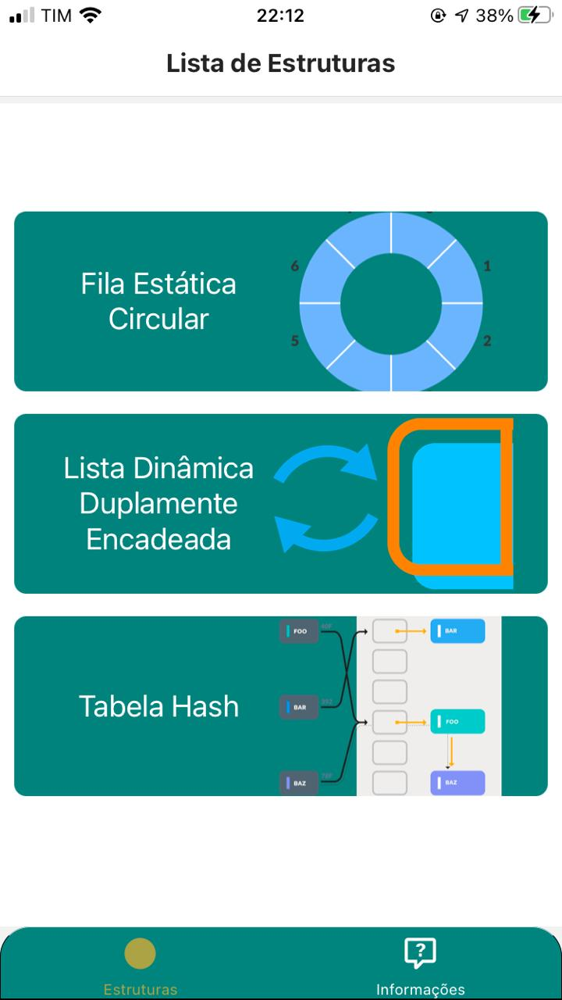
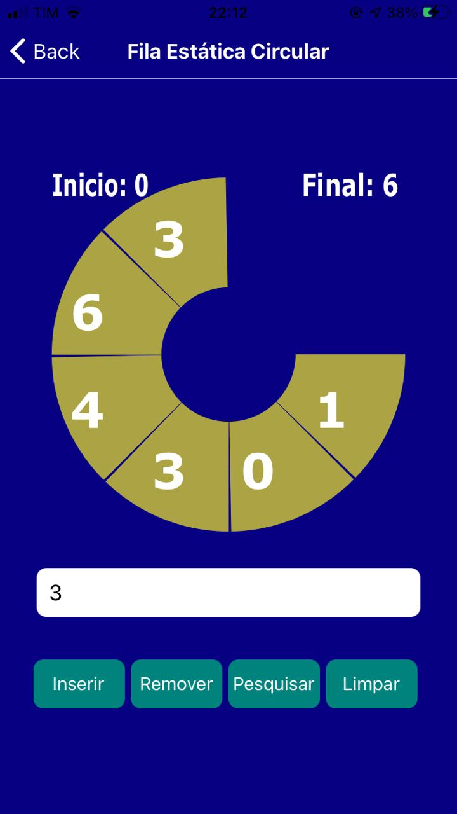
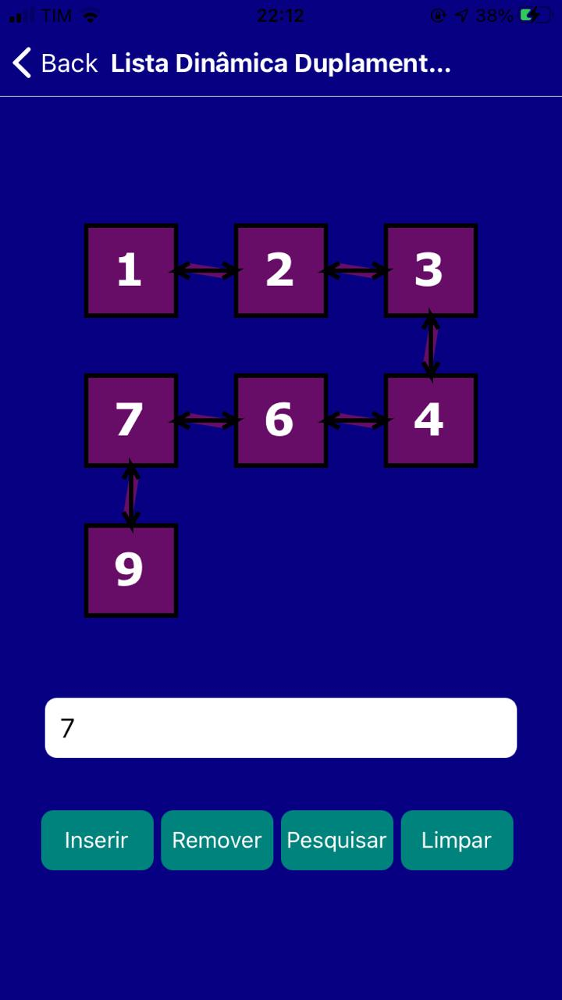
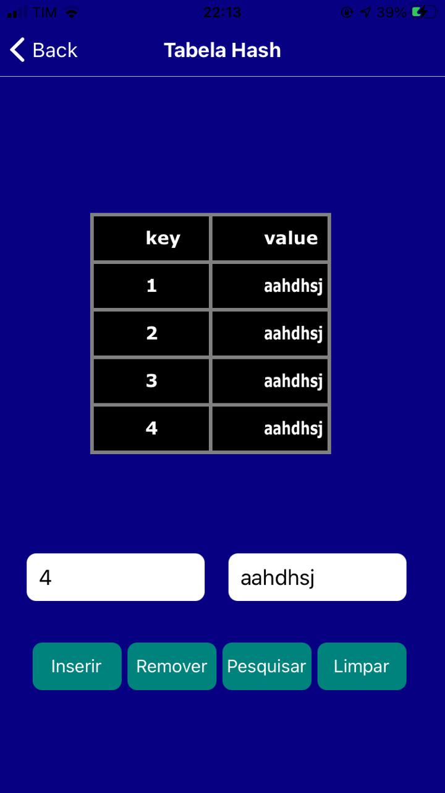
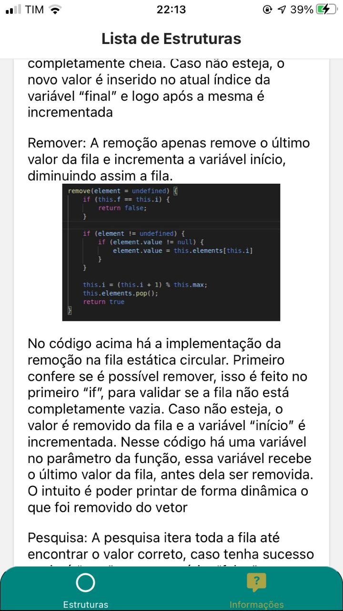

# Projeto - Estrutura de Dados

Projeto semestral da matéria de Estrutura de Dados, ministrada no Centro Universitário FEI. Consiste em um aplicativo mobile onde o usuário pode interagir com três estruturas de dados: Lista Dinâmica Duplamente Encadeada, Fila Estática Circular e Tabela Hash. Além de observar o funcionamento geral das estruturas é possível também visualizar a implemnetação das mesmas

## Funcionalidade

  
  

Logo que iniciado o usuário pode selecionar uma das estruturas para interagir:

**Fila Estática Circular** - O aplicativo permite ao usuário inserir, remover, pesquisar e limpar a estrutura, observando desse modo como a mesma funciona.

**Lista Dinâmica Duplamente Encadeada** - O aplicativo permite ao usuário inserir, remover, pesquisar e limpar a estrutura, observando desse modo como a mesma funciona.

**Tabela Hash** - O aplicativo permite ao usuário inserir, remover, pesquisar e limpar a estrutura, observando desse modo como a mesma funciona.

**Informações** - Essa tela exibe ao usuário uma explicação de cada uma das três estruturas do projeto, bem como permite ao mesmo observar sua implementação prática, por meio de imagens do código de cada uma.

## Execução

A execução da aplicação pode ser feita na plataforma online do expo.io ou de forma local, basta  executar os seguintes comandos:

```bash
expo start
```

Além disso, é possível executar o programa instalando o arquivo .apk contido na pasta apk deste repositório.

## Integrantes

O software em questão foi desenvolvido por 2 pessoas.

Antonio Muniz - https://www.linkedin.com/in/antuniooh/

Henrique Vital Carvalho - https://www.linkedin.com/in/henrique-vital-carvalho-45a82b192/
